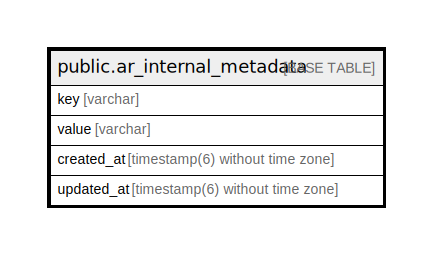

# public.ar_internal_metadata

## Description

## Columns

| Name | Type | Default | Nullable | Children | Parents | Comment |
| ---- | ---- | ------- | -------- | -------- | ------- | ------- |
| key | varchar |  | false |  |  |  |
| value | varchar |  | true |  |  |  |
| created_at | timestamp(6) without time zone |  | false |  |  |  |
| updated_at | timestamp(6) without time zone |  | false |  |  |  |

## Constraints

| Name | Type | Definition |
| ---- | ---- | ---------- |
| ar_internal_metadata_pkey | PRIMARY KEY | PRIMARY KEY (key) |

## Indexes

| Name | Definition |
| ---- | ---------- |
| ar_internal_metadata_pkey | CREATE UNIQUE INDEX ar_internal_metadata_pkey ON public.ar_internal_metadata USING btree (key) |

## Relations

---

> Generated by [tbls](https://github.com/k1LoW/tbls)
