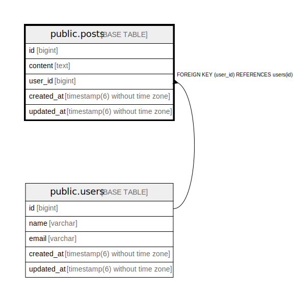

# public.posts

## Description

## Columns

| Name | Type | Default | Nullable | Children | Parents | Comment |
| ---- | ---- | ------- | -------- | -------- | ------- | ------- |
| id | bigint | nextval('posts_id_seq'::regclass) | false |  |  |  |
| content | text |  | true |  |  |  |
| user_id | bigint |  | false |  | [public.users](public.users.md) |  |
| created_at | timestamp(6) without time zone |  | false |  |  |  |
| updated_at | timestamp(6) without time zone |  | false |  |  |  |

## Constraints

| Name | Type | Definition |
| ---- | ---- | ---------- |
| posts_pkey | PRIMARY KEY | PRIMARY KEY (id) |
| fk_rails_5b5ddfd518 | FOREIGN KEY | FOREIGN KEY (user_id) REFERENCES users(id) |

## Indexes

| Name | Definition |
| ---- | ---------- |
| posts_pkey | CREATE UNIQUE INDEX posts_pkey ON public.posts USING btree (id) |
| index_posts_on_user_id | CREATE INDEX index_posts_on_user_id ON public.posts USING btree (user_id) |

## Relations

---

> Generated by [tbls](https://github.com/k1LoW/tbls)
